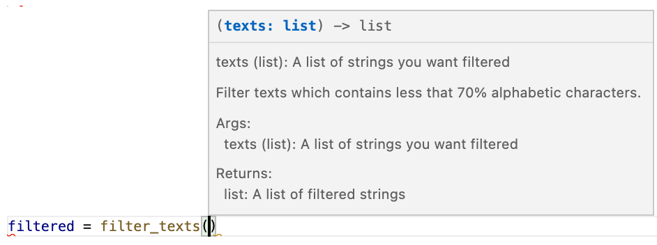

# Iterative development, an example

> Note: This section introduce functionalities the reader might not be familar with
> including the extended assignment operators `+=` opera and list comprehensions. This is 
> not meant to be a full introduction of these concepts, but simply to let the reader know
> that they exist.

We have a corpus of texts where we want to analyse speech patterns of people with 
specific diagnosis. We want to filter texts which contains less than 70% alphabetic
characters as this are likely not something we want to analyse.

I have cheated from home and implemented this function. What does this do? Do you
understand what is going on?
```python
def filter_text(texts):
  result = []
  for i in texts:

    counter = 0 
    for c in i:
      if c.is_alpha():
        counter = counter + 1
    
    if counter / len(i) > 0.7:
      result.append(i)
    
  return result
```

## Readability

You could likely figure it out, given some time but it is hard. We could def. make this
easier:

```python
def filter_texts(texts):
  filtered_texts = []
  for text in texts:

    n_alpha = 0 
    for char in text:
      if char.is_alpha():
        n_alpha += 1
    
    alpha_ratio = n_alpha / len(text)
    if alpha_ratio > 0.7:
      filtered_texts.append(text)
    
  return filtered_texts
```
We have now greatly improved the readability of the code, by changing the variable names. 
We have also added the additional variable `alpha_ratio`, which is strictly not necessary but
act as a comment saying "this thing I just calculated is a ratio between alphabetic
characters and the total number of characters". In the beginning, most people would probably
prefer the comment, but later on, too many comments feels cumbersome. This is intended to be short
and precise. We also use the `+= 1` operator as a shorthand for adding to the same variable. 
This is a python specific feature and also works with e.g. `-= n` for subtraction n or `*= n` for multiplying by n.

## Documentation

This is quite good, but you would probably still use some time parsing what the function
does, therefore, so let us add some documentation:

```python
def filter_texts(texts: list) -> list:
  """
  Filter texts which contains less that 70% alphabetic characters.

  Args:
    texts (list): A list of strings you want filtered

  Returns:
    list: A list of filtered strings
  """
  filtered_texts = []
  for text in texts:

    n_alpha = 0 
    for char in text:
      if char.is_alpha():
        n_alpha += 1
    
    alpha_ratio = n_alpha / len(text)
    if alpha_ratio > 0.7:
      filtered_texts.append(text)
    
  return filtered_texts
```

We have now added type hints to the function, these don't do anything, but informs
the reader. Typically your python interpreter is even smart enough to tell you if a function
takes e.g. a list (`text: lists`), but you have given it an integer (`filter_text(texts = 1)`).
We have also described what the function returns using type hints (`-> list`), namely a list. 
type hint can become quite complex, e.g. here we could have described it as being a list of strings:

```python
from typing import List

def filter_texts(texts: List[str]) -> List[str]:
```


<details>
  <summary>Why the import?</summary>

  Notice that the `List` is uppercased, this is to differentiate the type hint `List` 
  from the function `list` (which turn elements into lists).
  However, since the introduction of type hints python have since relaxed this 
  distinction and if you are using python version 3.10 (or higher) you don't even need
  the import and can simply use the lowercased `list`.

```python
def filter_texts(texts: list[str]) -> list[str]:
```

</details>

<br /> 

We also see that we have added the docstring, this is a description what the function does.
Typically, for a small function such as this, we typically don't need to describe the arguments
and returns. The type hint is enough.

Your interpreter will typically show you this information, for instance, were I to use this
the function we can see that an information box is shown (written in VS Code):



## Generalization

We could imagine that this function could be included in a text filtering
package, however, the threshold of 70% tokens seem quite arbitrary, so we can generalize
the function to allow for a wider use case:

```python
from typing import List

def alpha_text_filter(texts: List[str], min_ratio: float = 0.7) -> List[str]:
  """
  Filter texts which contains less that 70% alphabetic characters.

  Args:
    texts (List[str]): A list of strings you want filtered
    min_ratio (float, optional): The mininum ratio of alphabetic characters in the text.

  Returns:
    List[str]: A list of filtered strings
  """
  filtered_texts = []
  for text in texts:

    n_alpha = 0 
    for char in text:
      if char.is_alpha():
        n_alpha += 1
    
    alpha_ratio = n_alpha / len(text)
    if alpha_ratio > min_ratio:
      filtered_texts.append(text)
    
  return filtered_texts
```

## Refactoring

Typically, once you have spent time writing a function you realize that something could
have been done smarter, you then typically redo the function, this is what we call
refactoring and it is what we will do in this section. 


First let is rewrite in inner for loop as a list comprehension:

<br /> 

<details>
  <summary>What is a list comprehension? </summary>

A list comprehension is a short format for loop. It translates the format:

```python
mylist = [3, 4, 8]

output = []
for i in mylist:
    added1 = i + 1
    output.append(added1)
print(output)
# [4, 5, 9]
```

into:

```python
mylist = [3, 4, 8]

output = [i + 1 for i in mylist]
print(output)
# [4, 5, 9]
```

This is naturally much shorter and almost reads like text ("add 1 for each element in 
my list"). You can even do things like conditionals:

```python
mylist = [3, 4, 8]

# reads: add 1 for each element in my list if the element is less that 6
output = [i + 1 for i in mylist if i < 6]
print(output)
# [4, 5]
```

Similarly, it allows nested for loops:

```python
persons_class1 = ["anna", "peter", "marcus"]
persons_class2 = ["charles", "xavier", "anders"]
classes = [persons_class1, persons_class2]

# reads: give me the name for
output = [name for classroom in classes for name in classroom]
print(output)
['anna', 'peter', 'marcus', 'charles', 'xavier', 'anders']
```

This allows us to create very complex statements in a single line.

</details>

<br /> 

```python
from typing import List

def alpha_text_filter(texts: List[str], min_ratio: float = 0.7) -> List[str]:
  """
  Filter texts which contains less that 70% alphabetic characters.

  Args:
    texts (List[str]): A list of strings you want filtered
    min_ratio (float, optional): The mininum ratio of alphabetic characters in the text.

  Returns:
    List[str]: A list of filtered strings
  """

  filtered_texts = [] 
  for text in texts:
    is_alpha = [char.is_alpha() for char in text]

    alpha_ratio = sum(is_alpha) / len(text)
    if alpha_ratio > min_ratio:
      filtered_texts.append(text)
    
  return filtered_texts
```

here we create a list (`is_alpha`) if booleans, i.e. the text `"hey!"` would become
`[True, True, True, False]` and then we use the fact that booleans have a number value 
associated with then (`int(True) == 1` and `int(False) == 0`). Therefore when we sum over
`is_alpha` we get the number of alphabetic characters (3 in the case of `"hey!"`).

